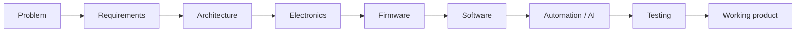

# Giannhs Mpanakakis

**AI & Automation Engineer**  
Embedded Systems · IoT · Flutter · Intelligent Products

Founder, [JMP Innovations](https://www.jmp-innovations.gr) · Remote — EU / Netherlands

I design and build **intelligent products** that join automation, software and embedded hardware into one working system — from architecture through electronics, firmware and the interface the operator actually uses.

[jmp-innovations.gr](https://www.jmp-innovations.gr) · [GitHub](https://github.com/jmp-gr) · [LinkedIn](https://www.linkedin.com/in/jmpanakakis)

---

## About

Electronics / Informatics & Electronic Systems Engineer (International Hellenic University — DIPAE). Currently an MSc student in **Applied Automation Systems** at the same school, and founder of **JMP Innovations**.

Work spans AI-driven automation, embedded/IoT, firmware, electronics, Flutter and web. The useful skill is not a single stack — it is **closing the loop** between a physical process and the software that runs it.

## What I build

### AI & automation
Workflow and process automation, system integrations, monitoring, and AI-assisted control around real operations — not isolated chat demos.

### Embedded & IoT
Microcontroller firmware (ESP32-class), sensors and actuators, telemetry, connected devices, and automation controllers that still run when the cloud is unreachable.

### Software products
Flutter apps, web UIs, dashboards, APIs and operational tools that sit on top of hardware or automation backends (including Firebase where the product needs a live data path).

### Electronics & product engineering
Electronic systems, prototypes, control hardware, electromechanical assemblies, and hardware/software integration into a physical product.

## Engineering approach

Same sequence whether the deliverable is a coop controller, a mobile client, or an automation workflow: define the problem, design the system, then implement across the layers that actually matter.

## Featured engineering projects

### Smart Chicken Coop
Undergraduate thesis system (DIPAE): an **off-grid automated poultry house** — ESP32-C6 control, sensors, RFID flock tracking, RTC scheduling, motorised door and feeder, frost protection, Wi-Fi, Firebase and a browser UI.

Among the department’s best theses (2025). First prize, IHU Innovation & Entrepreneurship (Universities of Excellence, 2026).

This is the first **flagship engineering case study** on this profile: a full public write-up ([architecture, hardware, firmware, measurements](https://github.com/jmp-gr/smart-chicken-coop)).

### JMP Innovations products

Commercial systems. Public material will stay **condensed** (problem, architecture, engineering scope) — not a full source dump.

**Tracker** — animal tracking / IoT product. A more detailed engineering note comes in a second phase.

**AiBook** — product write-up later, after the data and access model is set so private information stays off GitHub.

## Stack

| Domain | What I use in practice |
| --- | --- |
| Languages | C/C++ (firmware), Dart (Flutter), JavaScript / HTML / CSS (web) |
| Embedded | ESP32, sensors, actuators, I2C / UART / GPIO, RTC, RFID |
| Software | Flutter, web applications, Firebase, REST / JSON APIs |
| Automation | AI automation, workflow automation, API integrations |
| Engineering | Electronics, prototyping, CAD / 3D printing, system integration |

## Currently building

Intelligent hardware/software products and AI/automation systems under **JMP Innovations**, plus a public engineering portfolio aimed at **remote B2B work in the EU / Netherlands**.

## Collaboration

Open to **B2B and contract engineering** with product teams — especially in the Netherlands and the wider EU — on AI automation, embedded/IoT, and hardware/software integration.

If you are building something that has to work in the field as well as on a screen, that is the kind of problem I take on.

**[www.jmp-innovations.gr](https://www.jmp-innovations.gr)** · **[github.com/jmp-gr](https://github.com/jmp-gr)** · **[linkedin.com/in/jmpanakakis](https://www.linkedin.com/in/jmpanakakis)**

---

Building intelligent products where software meets the physical world.
